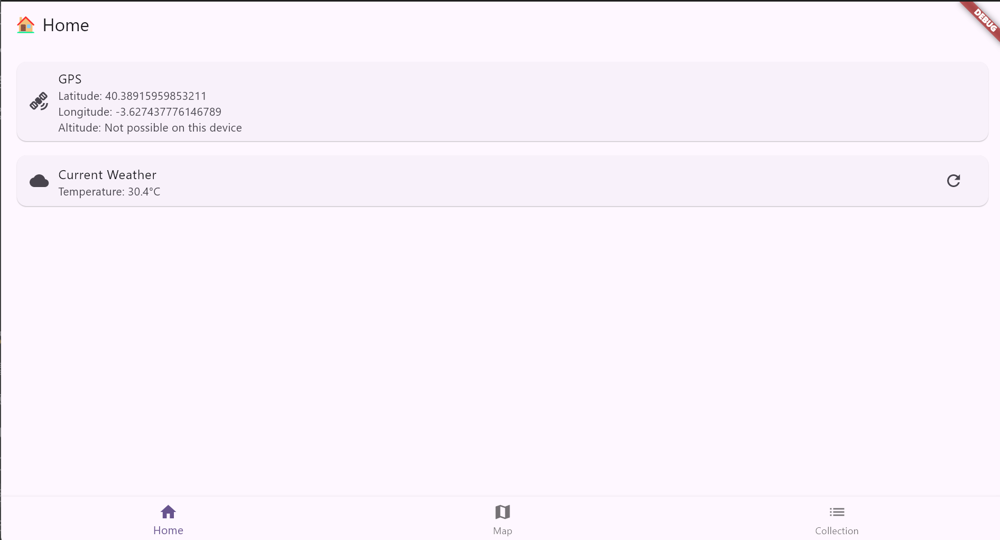
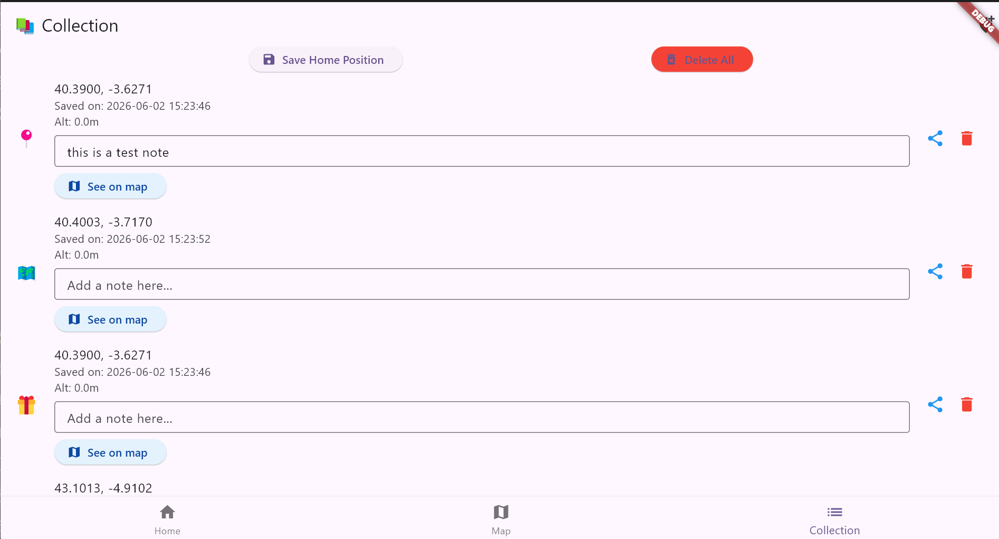

# Your App's Name (e.g., MADTracking)
CoordBank
# Workspace
Github:
- Repository: https://github.com/Altar-Z/CoordBank
- Releases: https://github.com/Altar-Z/CoordBank/releases/

Workspace: https://upm365.sharepoint.com/sites/Dart_Project/SitePages/CollabHome.aspx?market=es-ES

## Description
This app is a location management and sharing tool built with Flutter, designed to bridge the gap between automated GPS tracking and manual geographical interest. It allows users to capture real-time sensor data, annotate it with personal context, and share specific locations through a private, decentralized system.
## Screenshots and navigation

<table>
  <tr>
    <td>
      
      
Describe here image 1

    </td>
    <td>
      
      
Describe here image 2

    </td>
    <td>
      
      
Collection screen where you see all your saved points, add a notes to them and share and received points

    </td>
  </tr>
</table>

## Demo Video
Video demonstrating how the app works :

## Features

- Real-time GPS Tracking: The app captures and displays live coordinates, including latitude, longitude, and altitude, directly from the device's sensors.
- Manual Map Pointing: Users can navigate an interactive OpenStreetMap and use a fixed central crosshair to manually select and save specific coordinates.
- Contextual Weather Reporting: The app automatically fetches and displays live weather data (temperature) for the user's current location.
- Persistent CSV Storage: All saved locations are stored locally on the device in a CSV format, ensuring data is preserved even after the app is closed or the device is restarted.
- Personalized Annotations: Every saved point in the collection includes an editable text field, allowing users to write and store personal notes or descriptions for each location.
- Decentralized Location Sharing: Users can generate a unique Base64-encoded sharing code for any point in their collection. This code can be sent to friends, who can then "Add coordinate" by pasting the code to instantly recreate the point in their own app.
- Collection Management: Users have full control over their saved data, with functionalities to delete individual entries or use a "Delete All" feature to clear the entire local database
- "See on Map" Navigation: From the collection list, users can click a button to jump directly to the map screen, which will automatically center and zoom on the selected coordinates 
- Dynamic UI Updates: The app uses state management to ensure that saving a position from the Home screen or updating a note in the Collection screen is reflected immediately across all tabs without requiring a manual refresh

## How to Use

- Check Live Data: Open the Home tab to see your current GPS coordinates and local weather.
- Save Locations: Store your GPS position via "Save Home Position" in the Collection tab, or use the Map tab to point the crosshair and tap "Save pointed location".
- Add Notes: In the Collection tab, type into an entry's text box and press "Enter" to permanently save personal notes.
- Share & Receive: Tap the Share icon to copy a point's code to your clipboard; to add a friend's point, tap the "Add coordinate" icon and paste their code.
- View on Map: Tap "See on map" on any entry in your collection to automatically center the map on that specific coordinate.
- Manage Data: Use the trash icon to remove single points or the "Delete All" button to clear your entire history.

## Participants
List of MAD developers:
- solal de Montalivet (solal.montalivet@alumunos.upm.es)
- Yacine Bouchouia (yacine.bouchouia@alumunos.upm.es)

